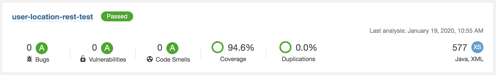

# User location REST test

Simple api to demonstrate calling a downstream endpoint for user records in 'London' plus users that have a longitude & latitude placing them within 50 miles of London (https://bpdts-test-app.herokuapp.com/).

For the purposes of this example the 'location' is fixed to **London** (but would most likely be an input parameter if this service was made more production ready).

#### code quality measures
<hr>

In the absence of any ci pipeline the following commands can be run to verify standards are being followed and the code is both compliant & efficient.

_checkstyle_ (https://maven.apache.org/plugins/maven-checkstyle-plugin/)

a slightly tightened implementation of 'checkstyle' bringing the violation severity down to _'warning'_ and allowing individual suppressions to be specified in _'src/test/resources/checkstyle-suppressions.xml'_

* `mvn clean checkstyle:check -Dcheckstyle.config.location=google_checks.xml -Dcheckstyle.violationSeverity=warning -Dcheckstyle.suppressions.location=src/test/resources/checkstyle-suppressions.xml`

_pmd_ (https://maven.apache.org/plugins/maven-pmd-plugin/)

a tightened implementation of pmd configured to fail on priority _'4'_ items

* `mvn clean pmd:check -Dpmd.failurePriority=4`

_sonarqube_ (https://www.sonarqube.org/)

standard sonarqube implementation using the _'sonar-project.properties'_ for configuration

* `mvn clean package sonar:sonar -Dsonar.host.url=<sonarqube-instance>`

current output for this version



#### build & package

builds the application and runs 'owasp' dependency checker for vulnerabilities (https://jeremylong.github.io/DependencyCheck/dependency-check-maven/plugin-info.html).

```mvn clean verify```

#### containerise

build the container, using the distroless version 11 base container (https://github.com/GoogleContainerTools/distroless)

`docker build -t user-location-rest-test:latest .`

_NOTE :: for managed devices it may be necessary to overwrite the 'cacerts' in the distroless image in order to correctly use downstream https services.  this can be achieved by adding a single line to the `Dockerfile` before the 'ENTRYPOINT' command._

`COPY <local-path-to-cacerts> /etc/ssl/certs/java/cacerts`

#### run container

the container can either be run using standard docker commands (remembering to set any environment variables and binding the external port) or using the project's docker-compose script.

`docker-compose up` (from the project's root directory)
